# 外付けHDDによる録画バックアップ方法

[[toc]]

## はじめに

レコーダーはFAT32でフォーマットされたUSBメモリまたは外付けHDDに対応しています。

市販されているUSBメモリの多くはFAT32でフォーマットされているため、そのままレコーダーに繋いで使用できますが、HDDはフォーマットが必要です。

以下の手順に従ってHDDをフォーマットしてください。

## フォーマット手順

外付けHDDをPCに繋ぎます。

Windowsの標準機能ではFAT32にフォーマットできないので[I-O DATA ハードディスクフォーマッタ](https://www.iodata.jp/lib/product/i/2107.htm)を使用します。

下記リンクからソフトをダウンロードします。

[ダウンロード](https://www.iodata.jp/lib/product/i/2107.htm)

ダウンロードフォルダを開き、ダウンロードしたEXEファイルを実行します。

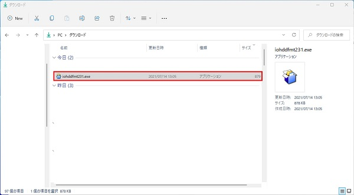

EXEファイルを実行するとデスクトップ画面にファイルが作成されます。

そのファイルの中のHDDFMT.exeを実行します。

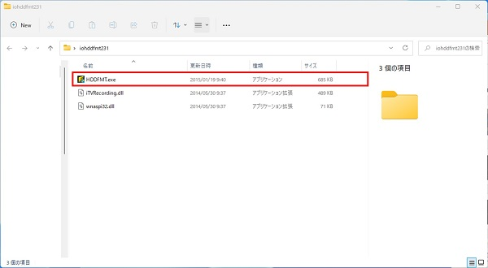

フォーマットするHDDを選択し、次へをクリックします。

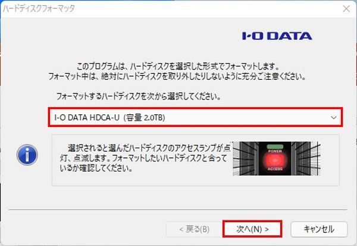

FAT32を選択し、次へをクリックします。

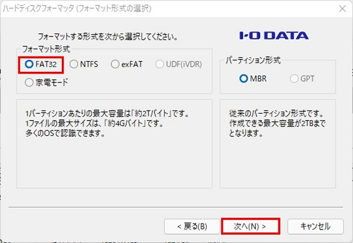

はいをクリックします。

注意事項に同意し、次へをクリックします。

実行をクリックします。

フォーマット完了後、完了をクリックします。

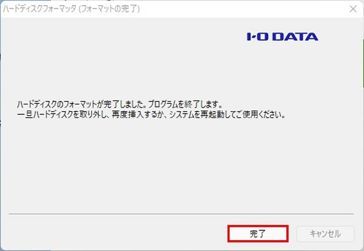

これでHDDのフォーマットは完了です。

## 外付けHDDによる録画データバックアップ手順
外付けHDDをフロントパネルまたはバックパネルのUSBポートに接続します。

検索画面を開きます。

- マウスの場合：右クリックして検索を開きます。
- リモコンの場合：SEARCHボタンを押します。

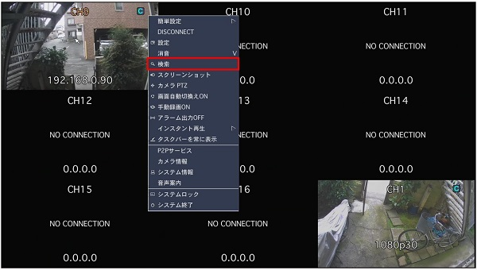

タイムライン検索を選択し、次へをクリックします。

日付を選択し、次へをクリックします。

赤いシークバーを移動させ、時間帯を選択します。

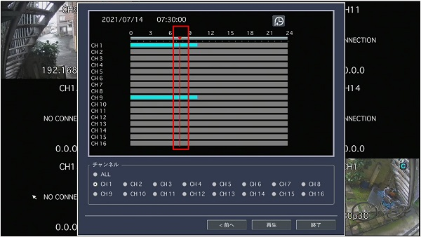

時間帯を細かく指定する場合は右上の時計アイコンをクリックします。

時計アイコンをクリックするとシークバーを15秒単位で移動できます。

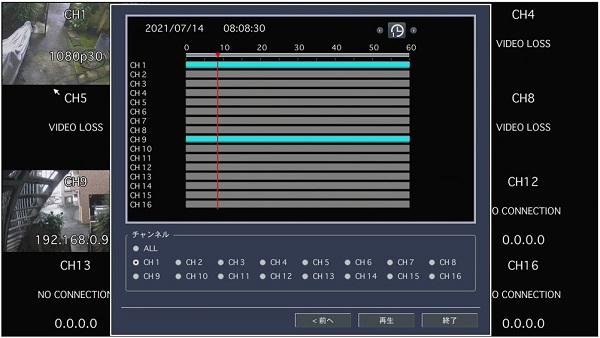

シークバーの移動が完了したら再生するチャンネルを選択し、再生をクリックします。

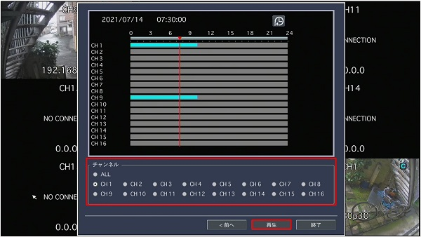

バックアップボタンを押します。

保存する形式を選択し、次へをクリックします。

画像を保存する場合は静止画、動画を保存する場合はAVIを選択してください。

- 静止画：BMPファイルを保存します。
- NSF：専用の動画再生ソフトとH.264形式の動画ファイルを保存します。
- AVI：AVI形式の動画ファイルを保存します。
- EXE：EXE形式で動画を保存します。

USBメモリーを選択し、次へをクリックします。

開始時刻と長さを指定し、開始をクリックします。

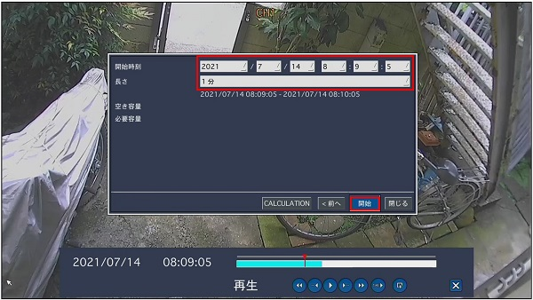

書き出しが完了したら閉じるをクリックします。これでバックアップは完了です。

## 1時間を超える動画のバックアップ

1時間以上の動画をバックアップする場合はNSF形式でバックアップしてください。

**※大容量バックアップ中は検索や再生の操作は行えません。**

NSF形式を選択して、次へをクリックします。

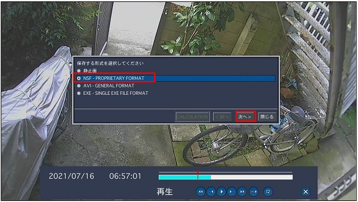

外付けHDD（大容量バックアップ）を選択して、次へをクリックします。

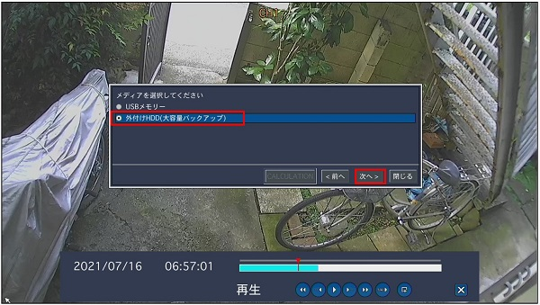

開始時刻と長さ（1～24時間）を選択して、次へをクリックします。

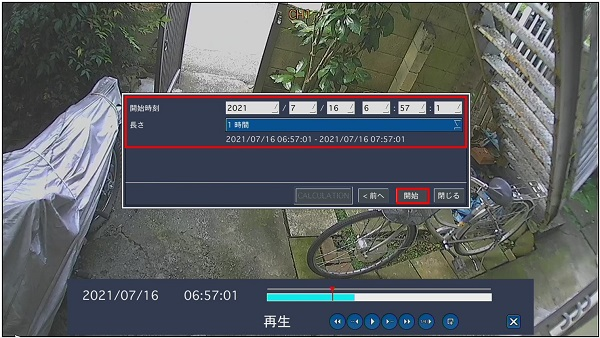

バックアップが開始されます。バックアップの進捗状況を確認する場合は右下のアイコンをクリックします。

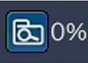

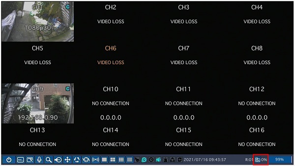

進捗状況が表示されます。画面を閉じる場合はOKをクリックしてください。

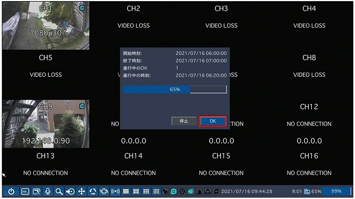

## バックアップした静止画・動画の見方

バックアップした静止画・動画はPCで確認できます。

バックアップに使用したUSBメモリや外付けHDDには日付ごとにフォルダが作成されています。

日付フォルダに静止画・動画が格納されています。

BMPファイルは静止画です。

時分秒で表記されたフォルダには動画（AVIファイルが格納されています。）

## NSF形式でバックアップしたデータの閲覧方法

NSF形式でバックアップファイルを作成した場合、USBメモリや外付けHDDにDvrPlayerとHYBRIDというフォルダが作成されます。

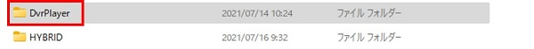

DvrPlayerフォルダには再生ソフトHDPlayer.exeが格納されています。

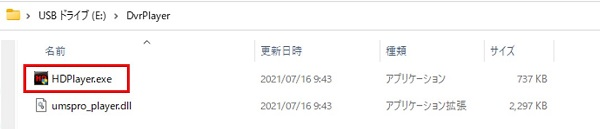

映像を見る場合はHDPlayer.exeを起動して、右下のフォルダアイコンをクリックします。

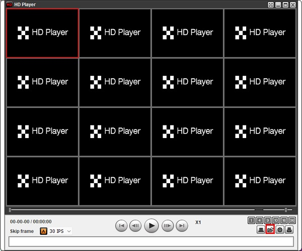

HYBRIDフォルダ＞日付フォルダ＞時分フォルダを選択して、OKをクリックします。

映像が再生されます。

**アイゼック最新のレコーダーはこちら▼**
- [【16ch同時再生, 4K対応機種】ANEモデル 製品ページ](https://isecj.jp/recorder/recorder-ane)

**レコーダーの導入事例を確認する▼**
- [多機能なデジタルレコーダーを使った導入事例](https://isecj.jp/case/security-enhancement)
- [マルチクライアントソフトの導入事例](https://isecj.jp/case/netcafe-camera)
- [レコーダー・センサー・警報機を連携した独自システムの構築事例](https://isecj.jp/case/system-design)