# 遠隔監視設定方法その２：ポート開放による遠隔監視の手順

[[toc]]

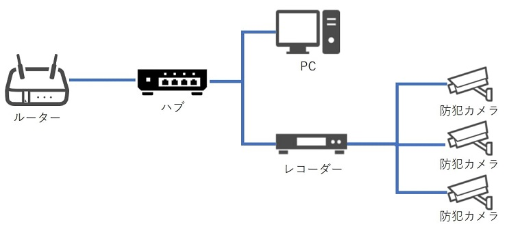

レコーダーに接続されているカメラの映像をインターネット経由で遠隔で見る為には、いくつかの設定が必要です。
1. レコーダーのネットワーク設定
2. ルーターのポート開放設定
3. DNS設定
4. 遠隔監視用ソフト UMSの設定
   
の４つです。

上記の４つの設定を行うことで、カメラの映像をパソコン・スマホから遠隔で監視することができます。

## レコーダーのネットワーク設定

レコーダーが接続されているローカルネットワークと同じネットワーク環境に設定する必要があります。

設定はレコーダーの設定画面から設定が可能です。

設定の手順として、まずローカルネットワークの環境を調べます。

### PC側の操作

ローカルネットワークに接続されているPCを使用します。

（ローカルネットワークとはルータから下の環境をローカルネットワークと呼びます）

#### 1：まずPC画面の左下の検索窓にcmdと打ちます。

するとコマンドプロンプトというアプリが表示されますのでコマンドプロンプトを起動します。

コマンドプロンプトを起動すると下のような黒い画面が表示されます。

#### 2：コマンドプロンプト上で `ipconfig`と入力してエンターを押すとローカルネットワークの環境情報が出てきます。

赤枠で囲んだ箇所の情報をメモしましょう。

**メモ内容**

- IPv4アドレス：192.168.0.7
- サブネットマスク：255.255.25..0
- デフォルトゲートウェイ：192.168.0.2

#### 3：レコーダーで使用するIPv4アドレスを決める。

レコーダーで使用するIPv4アドレスを決めます。このIPv4アドレスはローカルネットワーク内で被ってはいけません。

PCのIPv4アドレスが192.168.0.7なので、レコーダーのIPv4アドレスは192.168.0.7以外の値にする必要があります。

192.168.0.**7**　**太字で書いた番号だけ**を変更してください。
今回はレコーダーのIPv4アドレスは192.168.0.**53**にします。

この番号がローカルネットワーク内で使用されていないか確認します。

コマンドプロンプト上でping 192.168.0.**53**　と入力してエンターを押します。

ローカルネットワーク内で使用されていないIPv4アドレスの場合、左図のような返信が返ってきます。

もし右図のような返信が返ってきたら別の番号に変更して再度pingを入力を行ってください。

### レコーダー側の操作

#### 1：レコーダーをモニタに接続した状態で右クリックを押します。

ポップアップが出てくるので設定を選択します。

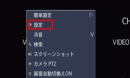

#### 2：IDとパスワード入力画面が出てくるので入力します。

#### 3：設定画面の上メニューからネットワークを選択（赤枠）し、IPアドレス、サブネットマスク、ゲートウェイを入力します。（青枠部）

（IPアドレス=IPv4のアドレスを入力してください）

従って今回の場合、以下の通りにします。

- IPアドレス：192.168.0.53
- サブネットマスク：255.255.255.0
- ゲートウェイ：192.168.0.2
- DNS(第１）：192.168.0.2（ゲートウェイと同じ番号を入力します）

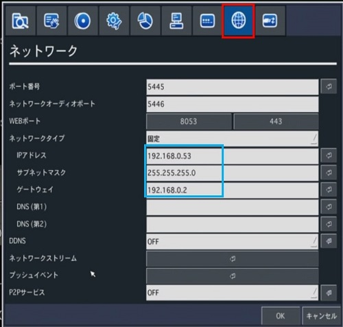

OKを押して設定完了です。

## ルーターの設定

遠隔から映像を見る為にはルーターでポート開放を行う必要があります。

ルータでポート開放を行うと外部から指定したポート番号に接続を依頼した際にルーターが取り次ぎ、指定したポート番号の機器へ接続する事ができます。

ルーターでポート開放されていないと接続はできません。

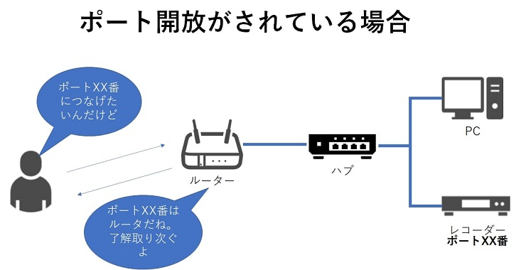

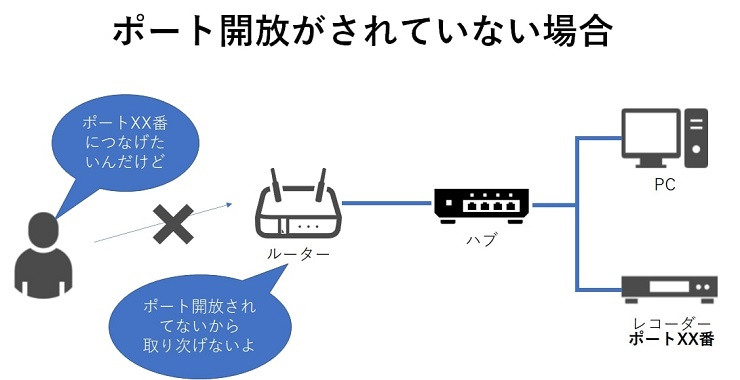

ポート開放のやり方はルーターを製造しているメーカや機種によって違う為、事前に確認が必要です。

[バッファローの場合](https://www.buffalo.jp/support/faq/detail/15022.html)

[NECの場合](https://www.aterm.jp/support/qa/qa/00020.html)

その他メーカー
- [TP-LINK](https://www.tp-link.com/jp/support/faq/2799/)
- [ASUS](https://www.asus.com/jp/support/FAQ/114093/)
- [エレコム](http://qa.elecom.co.jp/faq_detail.html?id=7097)
- [IODATA](https://www.iodata.jp/lib/manual/wn-ac1600dgr/ouyou/port.htm)
- [ヤマハ](https://network.yamaha.com/setting/router_firewall/ts_router/server_release)
- [CISCO](https://community.cisco.com/t5/cisco-start-%E3%83%89%E3%82%AD%E3%83%A5%E3%83%A1%E3%83%B3%E3%83%88/c841m-%E3%83%9D%E3%83%BC%E3%83%88%E3%83%95%E3%82%A9%E3%83%AF%E3%83%BC%E3%83%87%E3%82%A3%E3%83%B3%E3%82%B0-%E3%83%9D%E3%83%BC%E3%83%88%E8%BB%A2%E9%80%81-%E3%83%9D%E3%83%BC%E3%83%88%E9%96%8B%E6%94%BE-%E3%81%AE%E8%A8%AD%E5%AE%9A%E6%96%B9%E6%B3%95/ta-p/3158437)

今回は例としてバッファローのBHR-4GRV2というルータでポート開放を行います。

１）ネットブラウザを立ち上げて検索窓にⅡで確認したゲートウェイの番号を入れます。
本例だと192.168.0.2を入力します。

２）ルーターのログイン画面がでるのでユーザー名とパスワードを入力しログインます。

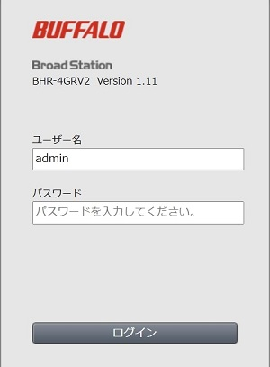

３）ログインしたら詳細設定（赤枠）をクリックします。

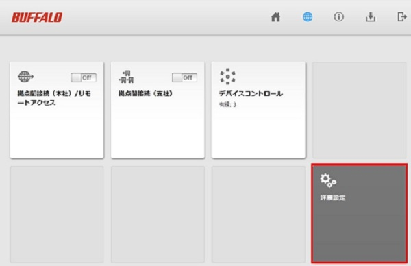

４）ページが切り替わったら左側のメニューから「セキュリティ」⇒ポート変換を選択します。

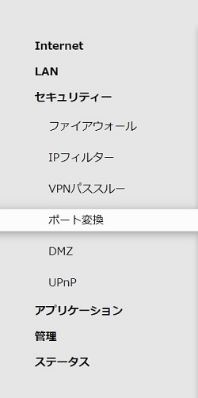

５）ポート変換の新規追加の赤枠部分を入力します。
TCP/UDP⇒任意のTCPポートを選択
任意のTCPポート／UDPポート⇒レコーダーのポート番号を入力（本例では5445)
LAN側IPアドレス⇒レコーダーのIPアドレスを入力（本例では192.168.0.53)
以上を入力して新規追加をクリックします。

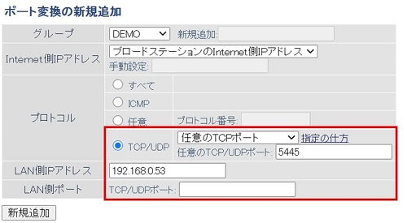

６）ポート変換情報に５）で設定した情報が登録されたら設定完了です。

## DDNSの設定

DDNSとは遠隔から接続する際に希望のドメイン名で接続可能にするサービスです。

例えばdemoというドメイン名をDNSに設定すると
demo.bestddns.comというドメイン名をUMSソフトで入力すれば遠隔から接続が可能です。

DDNS設定はアイゼックにて行いますので希望のドメイン名をアイゼックへご連絡ください。

（DDNS設定はアイゼックの製品をご購入頂いた方限定のサービスです）
[詳しい設定方法はこちらから](./function01-ddns.html)

## UMSクライアントソフトの設定

レコーダーに接続されているカメラの映像はＰＣ又はスマホから遠隔監視ができます。
ＰＣの場合UMSクライアントソフトをＰＣへダウンロードしてください。

①PCへUMSソフトをダウンロードしたらUMSソフトを立ち上げ、Setupを押します。

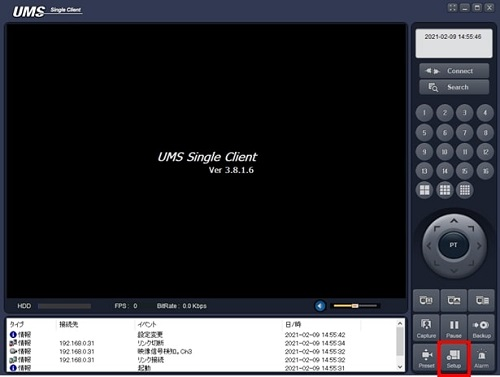

②セットアップのポップアップが出るので「接続先」を選択し、「追加」を押します。

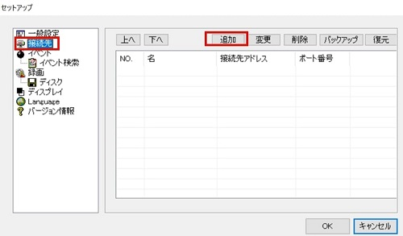

③ポップアップが出るので接続先を設定します。

- モデル：DVR/NVR
- 接続先：任意（今回はデモと設定）
- 接続先アドレス：DDNSで設定したドメイン名を入力
- ポート番号：ルーターでポート開放したポート番号を入力
- ID：レコーダーのIDを入力
- パスワード：レコーダーのパスワードを入力

以上を入力してOKを押します。

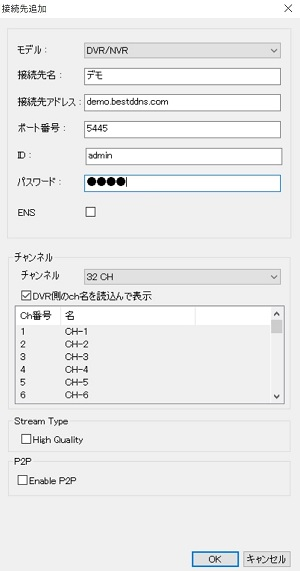

④UMSソフトでConnectを押すと設定した接続先が出てくるのでOKを押します。
設定が間違っていなければ接続ができます。

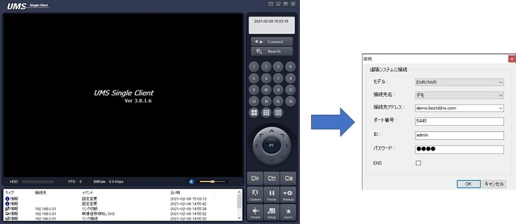

**アイゼック最新のレコーダーはこちら▼**
- [【16ch同時再生, 4K対応機種】ANEモデル 製品ページ](https://isecj.jp/recorder/recorder-ane)

**レコーダーの導入事例を確認する▼**
- [多機能なデジタルレコーダーを使った導入事例](https://isecj.jp/case/security-enhancement)
- [マルチクライアントソフトの導入事例](https://isecj.jp/case/netcafe-camera)
- [レコーダー・センサー・警報機を連携した独自システムの構築事例](https://isecj.jp/case/system-design)